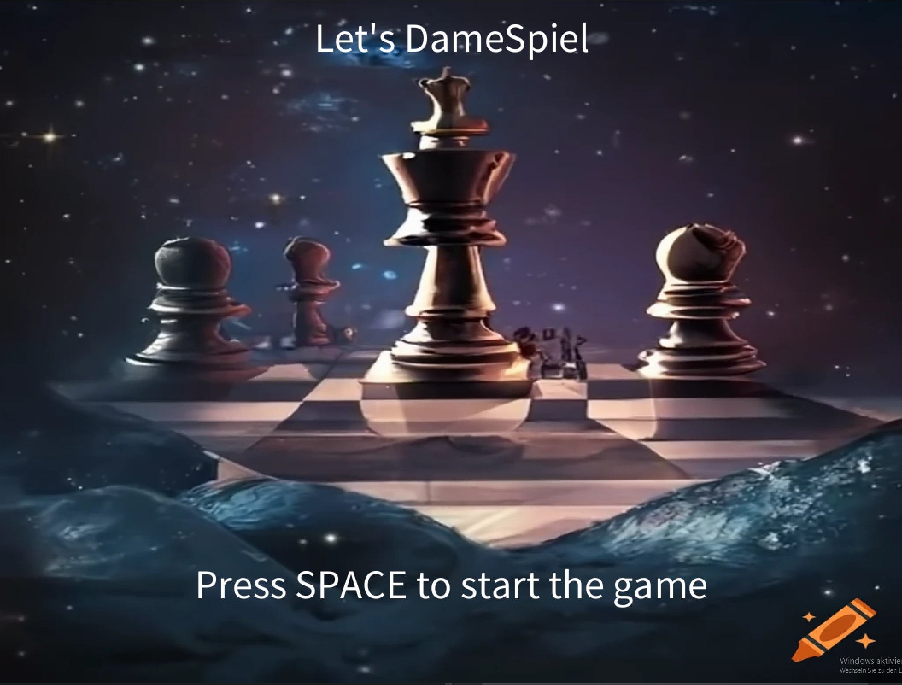
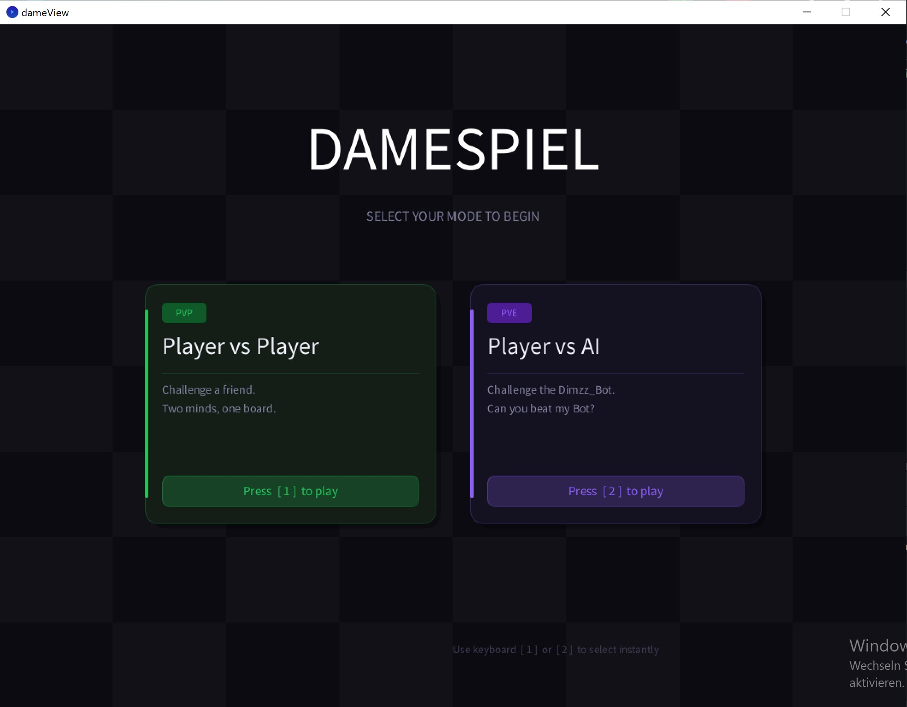
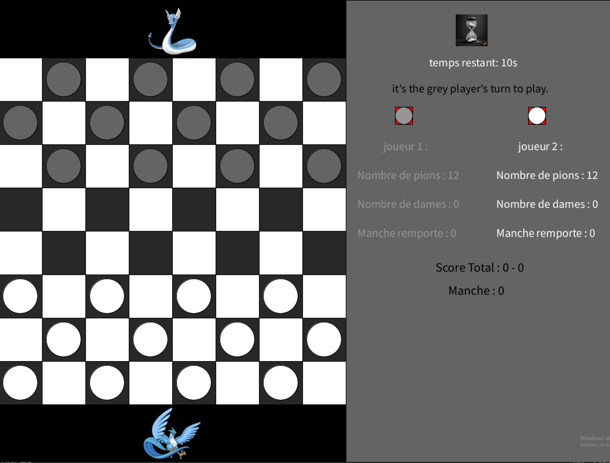
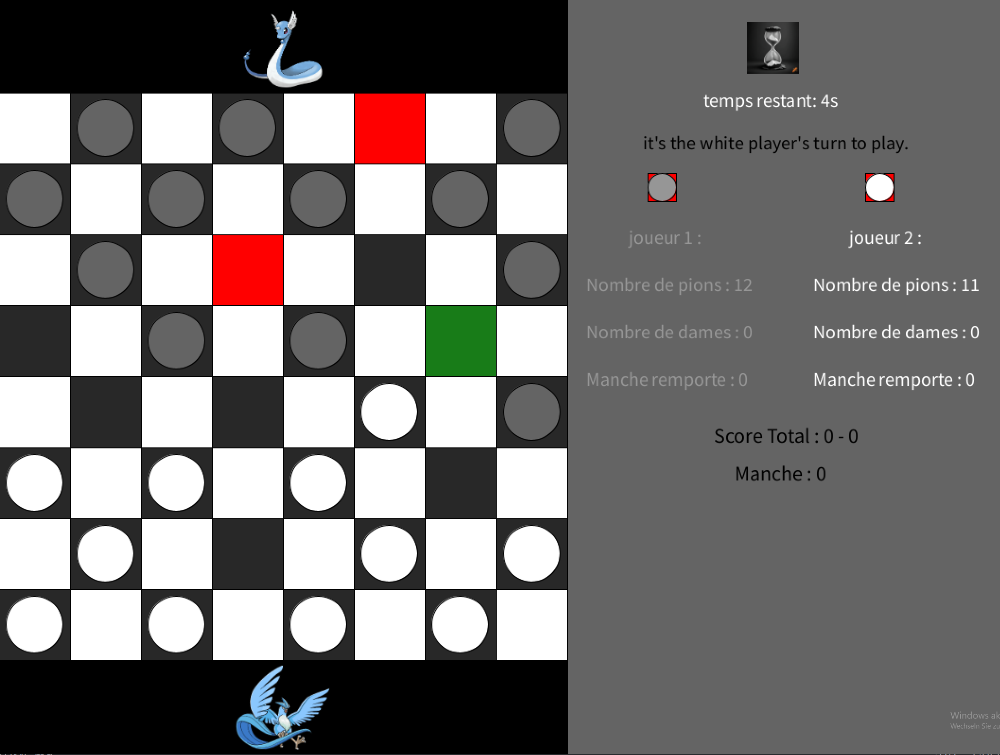
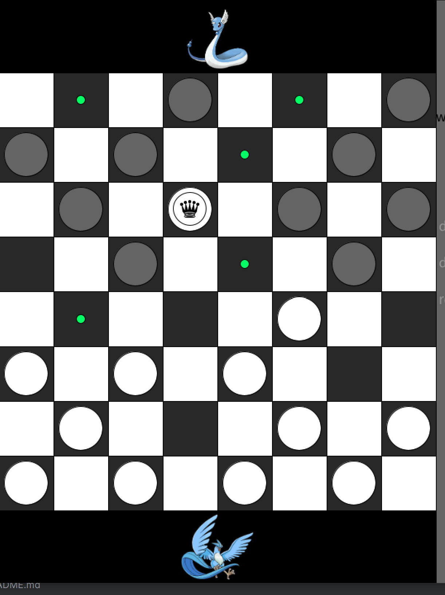
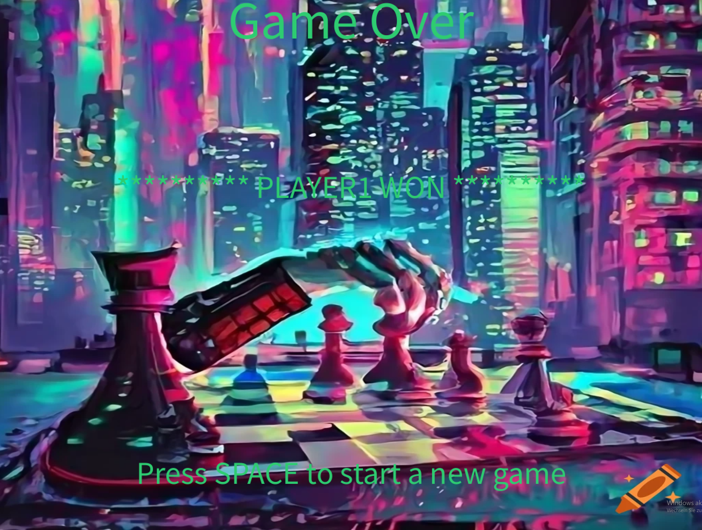
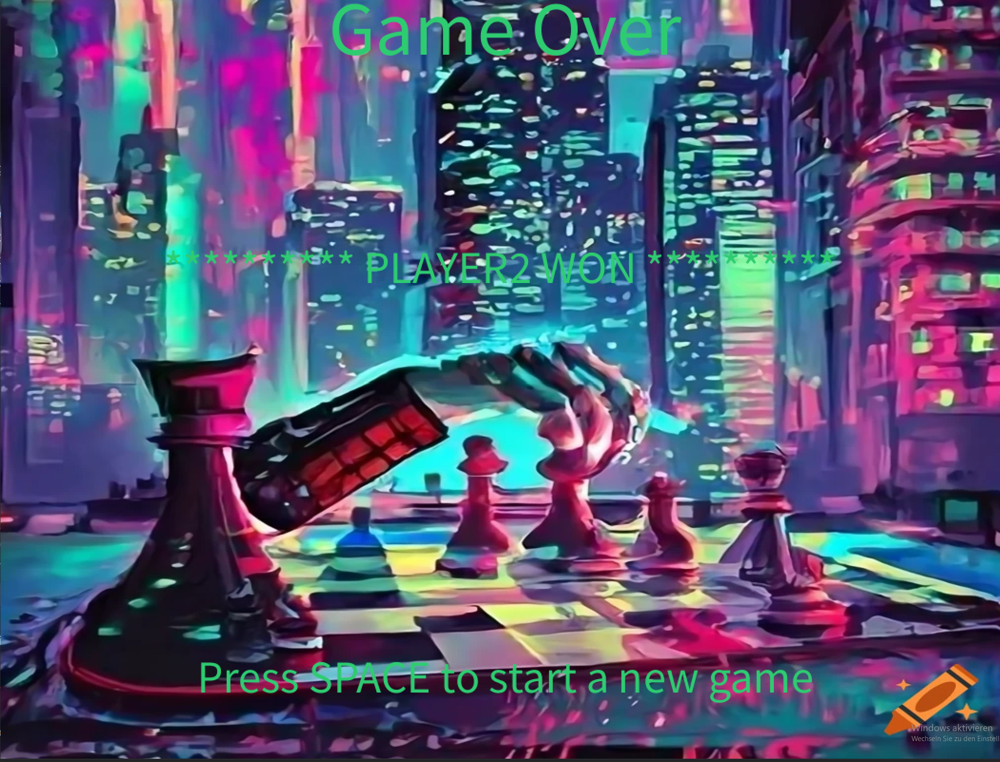
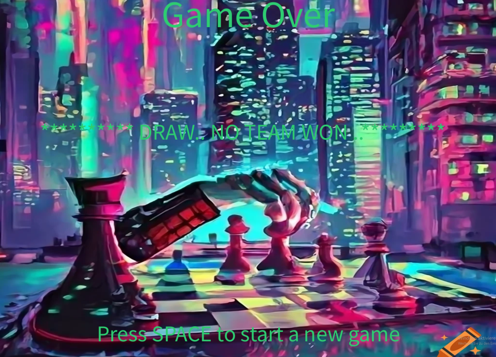

# Dame'Spiel

Dame ist ein strategisches BrettSpiel für zwei Spieler und wird auf einem Schachbrett mit 8 * 8 oder
international 10 * 10 Feldern gespielt..Dabei werden nur die schwarzen Felder des Spielbretts genutzt
, auf denen die typischen scheibenförmigen Spielsteine gezogen werden..Ziel des Spiels ist es ,
die generischen Steine vollständig durch überspringen zu schlagen oder bewegungsunfähig
zu machen und so das Spiel zu gewinnen..Einer der Spieler verliert entweder wenn er keinen Stein mehr hat oder wenn er mit seinen Steinen
keinen Zug mehr machen kann , weil seine Steine durch seinen Gegner blockiert sind.. oder wenn nach der Timer einer der Spieler 
mehr Steine als der andere hat..

Neu in dieser Version ist die Integration einer **künstlichen Intelligenz (KI)** sowie die Möglichkeit,
zwischen zwei Spielmodi zu wählen :
- Player vs Player
- Player vs AI

Die KI basiert auf dem **Minimax-Algorithmus mit Alpha-Beta-Pruning** und spielt als Player 2.

## Verwendete Bibliotheken

Das Program verwendet die folgenden Bibliotheken

- [Processing](http://www.processing.org)
- [JUnit](https://junit.org/junit5/)

## Screenschots
Kurze Übersicht über das Spiel..

StartBild..

Neuer Bildschirm zur Auswahl des Spielmodus (Player vs Player oder Player vs AI)..

Hier haben Sie einen kurzen Übersicht über die Funktionalitäten.
Beim Ende der Timer wird das Spiel sofort beendet.

Hier kann festgestellt werden, dass die verschiedenen möglichen bewegungen für
einen Stein entweder rot oder grün oder die rot und grün dargestellt.
wird der mögliche Zug rot dargestellt dann bedeutet das, dass einen Schlag 
in diese Richtung möglich ist..wird der hingegen grün dargestellt dann zeigt es
einen einfachen Zug...

verglichen mit den möglichen Bewegungen eines Stein wird die möglichen Züge von der Dame
durch grüne Punkte dargestellt unabhängig davon ob einen Schlag möglich ist oder nicht

EndBild wenn der Gewinner der Player1 ist

EndBild wenn der Gewinner der Player2 ist (oder die KI im PVE Modus)

EndBild wenn keiner gewinnt

## Künstliche Intelligenz

Die KI spielt als Player 2 und verwendet den Minimax-Algorithmus mit Alpha-Beta-Pruning.
Sie simuliert mögliche Spielzüge auf Kopien des Spielfelds, ohne den echten Zustand zu verändern.

Bewertungsfunktion :

- Bauer Player 2  : +10 Punkte
- Dame Player 2   : +30 Punkte
- Bauer Player 1  : -10 Punkte
- Dame Player 1   : -30 Punkte

Die KI versucht somit ihren Vorteil zu maximieren und den des Gegners zu minimieren.

## Architektur

Das Projekt wurde nach dem MVC-Prinzip strukturiert :

- Model :
    - Spiellogik und Regeln
    - Interface `IdameModel`
    - Verwendung von Enum :
        - `GameMode` (PVP / PVE)
        - `PieceType` (PION_J1, DAME_J1, etc.)

- View :
    - Darstellung mit Processing (`dameView`)
    - Keine Spiellogik enthalten

- Controller :
    - Verbindet Model und View
    - Verarbeitet Benutzerinteraktionen

## Startanleitung
zum **Starten des Spiels**  muss die `main()`-Methode
in der *Datei*`Main.java` vorhanden sein.

1. Öffnen der Datei `Main.java`
2. Starten der Funktion `main()`
3. Drücken Sie `SPACE`
4. Wählen Sie den Modus :
   - Taste `1` → Player vs Player
   - Taste `2` → Player vs AI

## JShell Anleitung

1. Starten einer Konsole
2. Den Befehl `jshell --class-path ./out/production/damesGame`
   in der Kommandozeile eingeben.
3. Importieren Sie die Package Dame.Model mit dem Befehl `import Dame.Model.*;`
4. Erstellen Sie ein Objekt des Modells :
   `jshell> dameModel model = new dameModel();`
5. Rufen Sie dann eine Methode auf dem bereits herstellten *Objekt* auf :
   - Neues Spiel : `model.newgame();`
   - Zustand anzeigen : `model.toString();`
6. Weitere Beispiele :
   - Spielfeld initialisieren : `model.InitPlateaujeu();`
   - Anzahl der Steine Player 1 : `model.getNbrPionPlayer1();`
