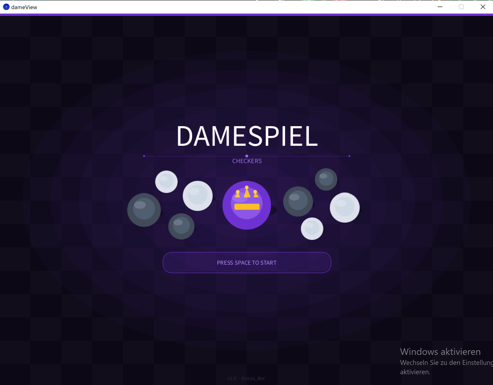
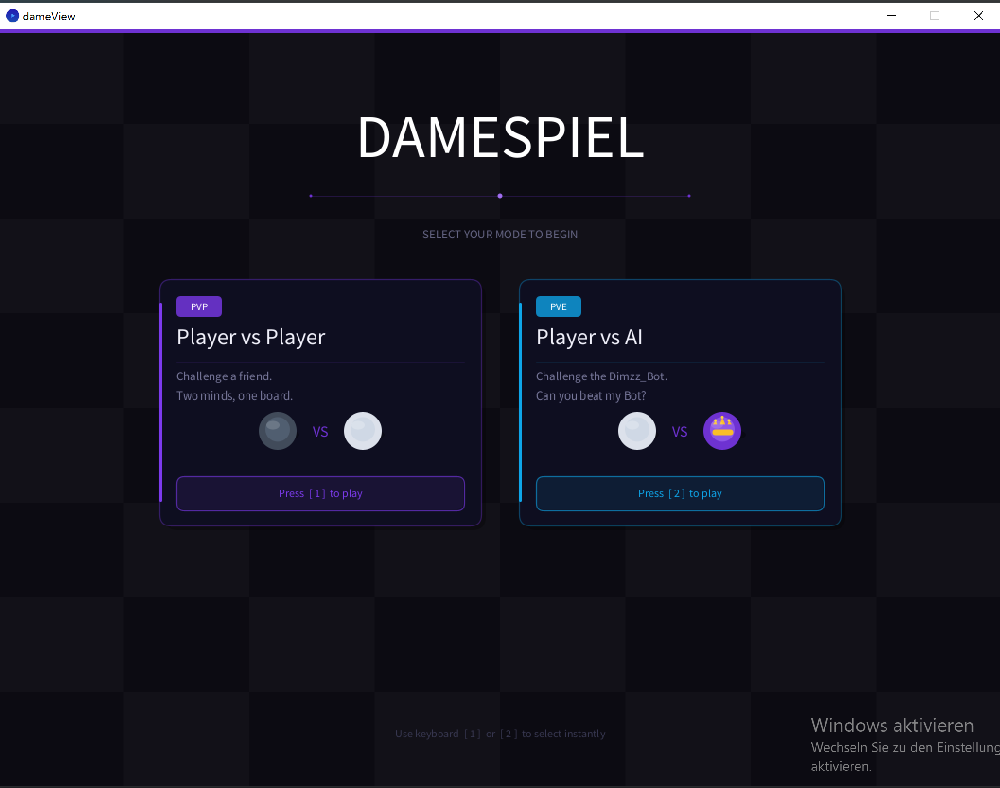
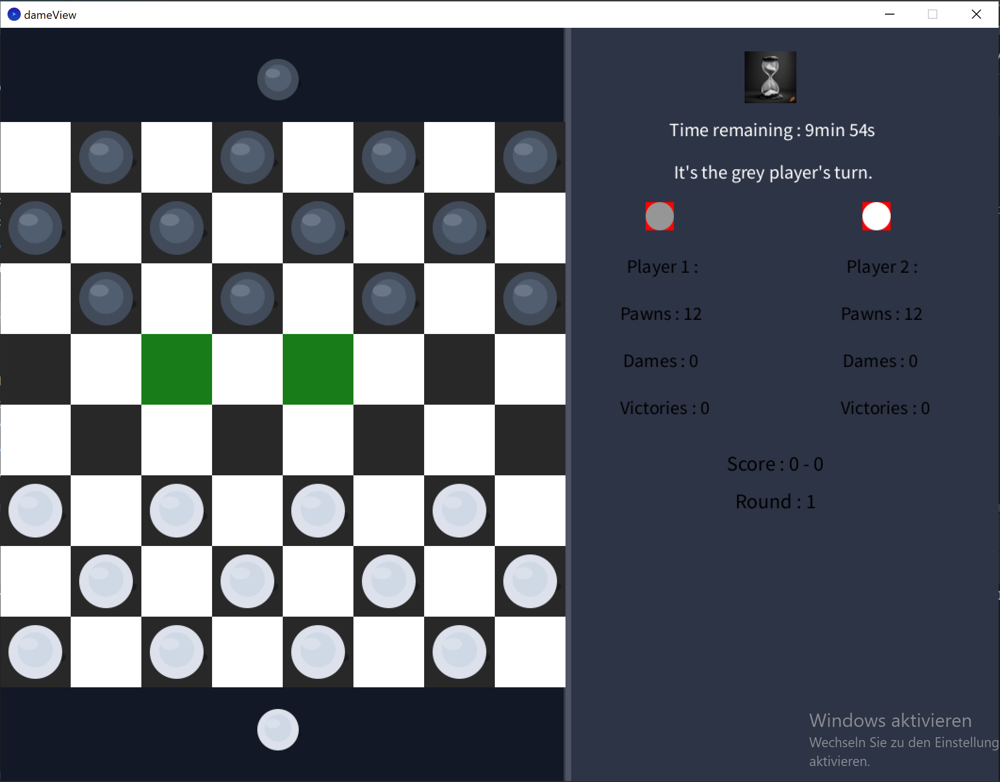
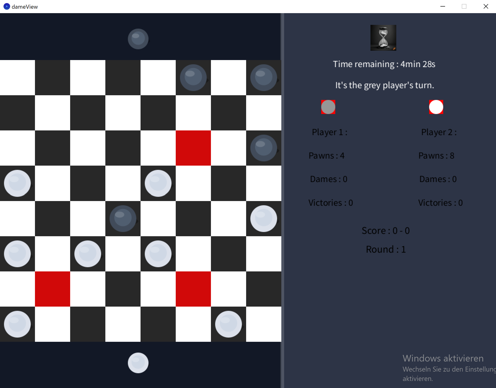
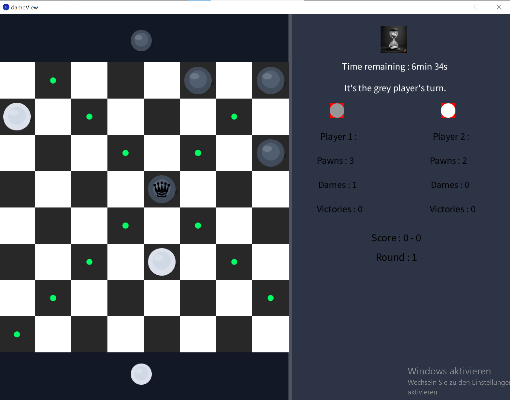
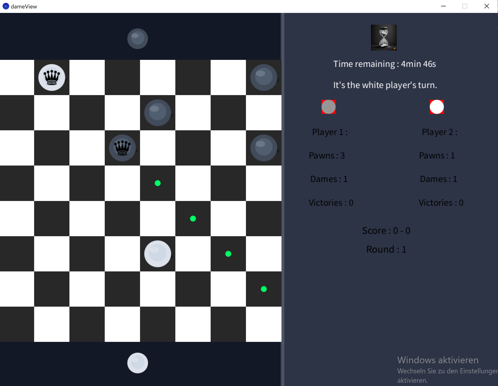
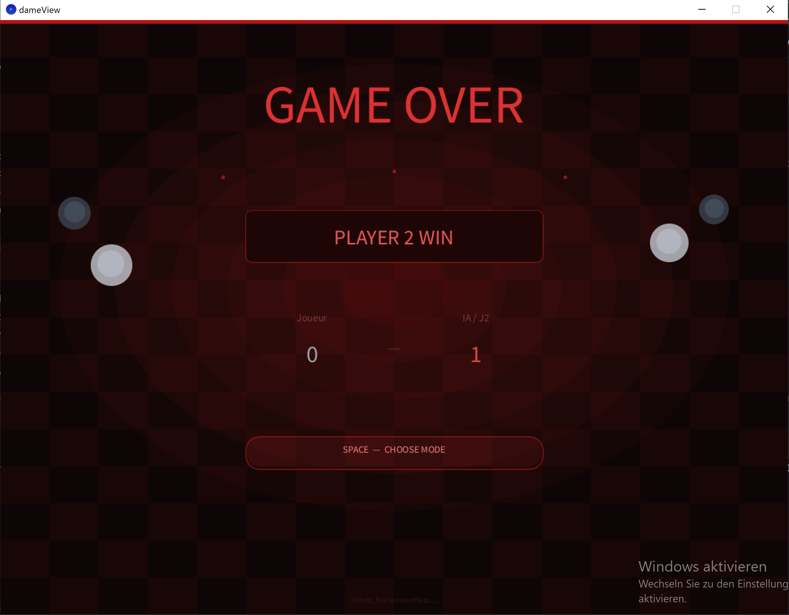
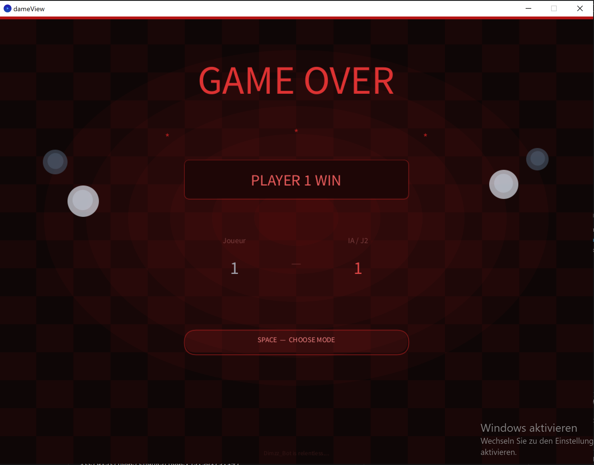
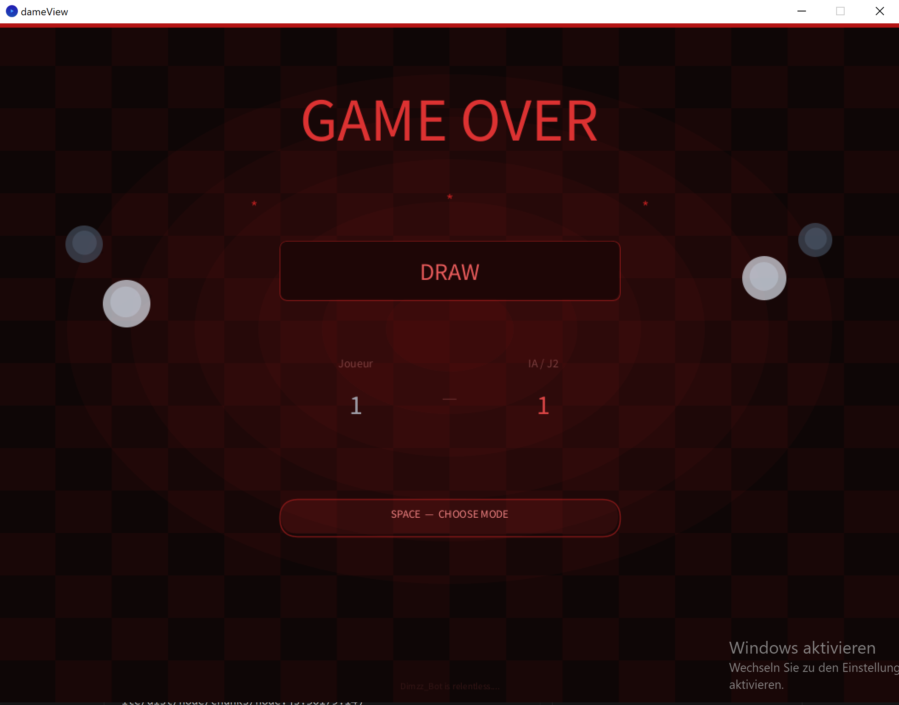

# DameSpiel

DameSpiel is a strategic two-player board game played on an 8×8 checkerboard.
Only the dark squares are used, and pieces move diagonally across them.
The goal is to eliminate all of your opponent's pieces by jumping over them,
or to leave them with no legal moves.

This version features an **Artificial Intelligence opponent** and two game modes:
- **Player vs Player** — play locally against a friend
- **Player vs AI** — challenge the Dimzz_Bot, powered by Minimax with Alpha-Beta Pruning

---

## Rules

### Basic Movement
- Pieces (pawns) move **diagonally forward** by one square onto an empty dark square.
- Only dark squares are used at all times.

### Capturing
- A piece **must** capture an opponent's piece if the opportunity exists (mandatory capture).
- Capturing is done by **jumping over** an adjacent opponent piece onto the empty square directly behind it.
- If after a capture another capture is possible from the new position, the player **must continue capturing** (chain capture).
- **Exception:** if a pawn reaches the promotion row during a chain capture, it is promoted to a Queen and its turn **ends immediately** — it may not continue capturing as a Queen in the same turn.

### Promotion (Queen / Dame)
- A pawn that reaches the **opponent's back row** is promoted to a **Queen (Dame)**.
- Queens can move **any number of squares diagonally** in any direction (forward or backward).
- Queens can capture over any distance and land on any free square behind the captured piece.
- Promotion ends the turn immediately, even if further captures would be possible.

### Winning Conditions
A player wins when the opponent:
1. Has **no pieces left** on the board, or
2. Has **no legal moves** available (all pieces are blocked).

### Timer
- Each game has a **10-minute timer**.
- When the timer runs out, the player with **more pieces remaining** wins.
- If both players have the same number of pieces, the game ends in a **draw**.

---

## Game Modes

| Mode | Description |
|------|-------------|
| **PVP** | Two human players take turns on the same machine |
| **PVE** | One human player faces the Dimzz_Bot AI |


## Artificial Intelligence

The AI plays as **Player 2** and uses the **Minimax algorithm with Alpha-Beta Pruning**.
It simulates possible moves on copies of the board without modifying the real game state.
The search depth is set to **4 half-moves (plies)**, balancing strength and response time.

### Evaluation Function

| Piece | Score |
|-------|-------|
| Player 2 Pawn | +10 |
| Player 2 Queen | +30 |
| Player 1 Pawn | −10 |
| Player 1 Queen | −30 |

The AI maximizes its own advantage while minimizing the opponent's.

---

## Screenshots

**Splash screen**



**Mode selection screen**



**In-game view — move hints (red = capture, green = normal move)**





**Queen move hints shown as green dots**





**Game Over — Player 2 / AI wins**



**Game Over — Player 1 wins**



**Game Over — Draw**



---

## Architecture (MVC)

The project follows the **Model-View-Controller** pattern:

```
Dame/
├── Model/
│   ├── dameModel.java       — Game logic and rules
│   ├── IdameModel.java      — Model interface
│   ├── PieceType.java       — Enum: PION_J1, DAME_J1, PION_J2, DAME_J2, VIDE, BLANC 
│   ├── GameMode.java        — Enum: PVP, PVE
│   └── Gamestate.java       — Enum: START, MODE_SELECT, PLAYING, GAME_OVER
├── View/
│   ├── dameView.java        — Rendering with Processing (no game logic)
│   └── IdameView.java       — View interface
├── Controller/
│   ├── dameController.java  — Connects Model and View, handles input
│   ├── IdameController.java — Controller interface
│   └── timerThread.java     — Background thread managing the countdown
└── IA/
    └── dameIA.java          — Minimax AI engine
```

**Key design decisions:**
- The View contains **no game logic** — it only draws what the Controller tells it to.
- The AI runs in a **separate thread** to avoid freezing the display during calculation.
- Stateless methods in the Model work on **board copies** so the AI can simulate freely.

---

## Libraries

| Library | Purpose |
|---------|---------|
| [Processing](https://processing.org) | Rendering and window management |
| [JUnit 5](https://junit.org/junit5/) | Unit testing |

---

## Getting Started

### Running the game

1. Open `Main.java`
2. Run the `main()` method
3. Press `SPACE` on the splash screen
4. Select a mode:
   - Press `1` → Player vs Player
   - Press `2` → Player vs AI

### Controls

| Action | Input |
|--------|-------|
| Select a piece | Left click |
| Move / capture | Left click on highlighted square |
| Navigate menus | `SPACE`, `1`, `2` |

---

## JShell Quick Start

Test the model logic directly from the command line:

```bash
# 1. Start JShell with the compiled classes on the classpath
jshell --class-path ./out/production/damesGame

# 2. Import the model package
import Dame.Model.*;

# 3. Create a model instance
dameModel model = new dameModel();

# 4. Try some methods
model.toString();              // Print the board
model.getNbrPionPlayer1();     // Number of Player 1 pawns
model.getNbrPionPlayer2();     // Number of Player 2 pawns
model.newgame();               // Reset the game
```

---

## Author

### *Dimitry Ntofeu Nyatcha* - *Dimzz_Bot edition*
